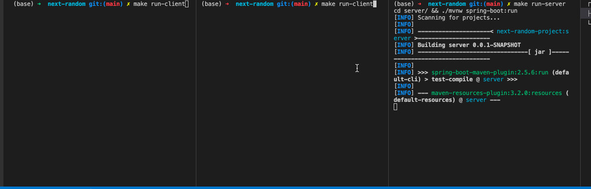

<h1 align="center">next-random</h1>

# Description

A command-line-based connect 4 style game.



## How it works

The game is made up of a board of 6 rows and 9 columns.

The game supports two players per game and each player is assigned a player token - either an "X" or an "O".
In turns, each player selects a column where they would like their token to be dropped. The token is droped in the first empty spot in that column if there's still free spaces in it. If the selected column is already full, the player will be prompted to play again and choose a different column.

Players play in turns untill one player wins by connecting 5 player tokens of the same type either in the horizontal, vertical or diagonal. The game can also end up in a tie if the board is full and no winner was found. If one of the players disconnects from the game (i.e. pressing CRTL+C) the game will end and the other player in the game will be notified of that.

# Developed with

- Java 
- Spring Boot
- JUnit
- Maven

# Installation

### Java/JVM

Ensure you have Java 11 installed. You can download from https://www.oracle.com/java/technologies/downloads/.

### Download the repository files

- You can clone the repository using Git:
    - from the command line type
        - ```git clone https://github.com/sn-lp/next-random.git``` (if you are using HTTPS)
        - OR
        - ```git clone git@github.com:sn-lp/next-random.git``` (if you are using SSH)
- You can download as a ZIP:
    [screenshot here of where to go]
    - go to the directory where the folder was downloaded to and unzip the folder:
        - ```unzip [name-of-folder]```


### Installing all necessary dependencies and compiling the code

- From the projects' root folder, from the command line interface, type:
```make compile-all```

# How to play

1. Open three terminals
- one terminal is going to be used to run the server application
- the other two terminals are used to run two client applications - one for each player in the game

2. Make sure you are in the projects' root folder in all of the three terminal tabs

3. Start the server application on the server tab
```make run-server```

4. Start the client application on each of the client tabs
```make run-client```

5. Each client will be prompted to enter a player username. Any character, word or numbers are accepted.

6. Each player is notified by the client application when is their turn to play, if the the opponent player is playing or if the game is finished. The state of the game is displayed after each play (i.e. the board is displayed, as well as info regarding what's happening - win, lose, tie, waiting for oponent to play, ...).

7. To exit the game press CTRL+C.
